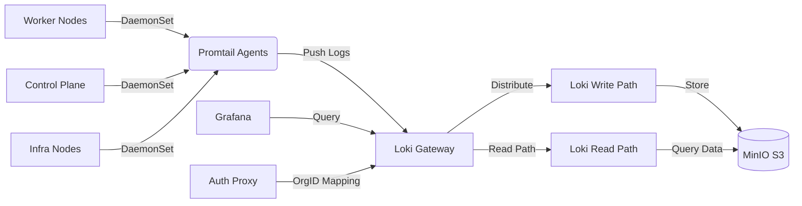

# Loki Logging Stack для Kubernetes

- [Loki Logging Stack для Kubernetes](#loki-logging-stack-для-kubernetes)
  - [Общая архитектура](#общая-архитектура)
  - [Компонент 1: Promtail Agent](#компонент-1-promtail-agent)
    - [Зачем нужен этот компонент](#зачем-нужен-этот-компонент)
    - [Особенности реализации](#особенности-реализации)
      - [1. Полнодисковый доступ к логам](#1-полнодисковый-доступ-к-логам)
      - [2. Безопасная передача в Loki](#2-безопасная-передача-в-loki)
      - [3. Обогащение метаданными](#3-обогащение-метаданными)
  - [Компонент 2: Grafana Loki](#компонент-2-grafana-loki)
    - [Зачем нужен этот компонент](#зачем-нужен-этот-компонент-1)
    - [Особенности реализации](#особенности-реализации-1)
      - [1. Multi-кластерное развертывание](#1-multi-кластерное-развертывание)
      - [2. Enterprise-хранилище](#2-enterprise-хранилище)
      - [3. Мульти-тенантность через OrgID](#3-мульти-тенантность-через-orgid)
      - [4. Отказоустойчивость](#4-отказоустойчивость)
  - [Интеграция с инфраструктурой](#интеграция-с-инфраструктурой)
    - [1. Доступ через Cilium Gateway API](#1-доступ-через-cilium-gateway-api)
    - [2. Безопасность](#2-безопасность)
    - [3. Мониторинг](#3-мониторинг)
  - [Разворачивание и управление](#разворачивание-и-управление)
    - [GitOps-стратегия](#gitops-стратегия)
    - [Стратегия обновления](#стратегия-обновления)
  - [Production-рекомендации](#production-рекомендации)

## Общая архитектура

Репозиторий `fleet-logging-stack` предоставляет **единый стек централизованного логирования** для Kubernetes-кластеров, основанный на Grafana Loki и Promtail. Архитектура реализует enterprise-grade подход к сбору, хранению и анализу логов:



## Компонент 1: Promtail Agent

### Зачем нужен этот компонент

Promtail — это **агент для сбора логов** на всех нодах кластера, решающий ключевые проблемы:

- 📁 Автоматическое обнаружение и сбор логов всех подов
- 🔍 Обогащение логов метаданными Kubernetes (namespace, pod, container)
- 🚀 Эффективная передача логов в центральное хранилище
- 🔄 Отслеживание позиции чтения логов между перезапусками
- 🛡️ Безопасная передача данных с TLS и аутентификацией

**Проблемы, которые решает:**

- Потеря логов при перезапуске/удалении подов
- Отсутствие контекста при анализе логов (какому приложению принадлежит лог)
- Сложность сбора логов системных компонентов (kubelet, containerd)
- Невозможность поиска по логам в распределенной среде

### Особенности реализации

#### 1. Полнодисковый доступ к логам

```yaml
volumes:
  - name: logs
    hostPath:
      path: /var/log
volumeMounts:
  - name: logs
    mountPath: /var/log
```

- Сбор логов из `/var/log/pods/*` для всех контейнеров
- Поддержка Docker-форматированных логов через pipeline stages
- Tolerations для работы на control-plane и infra нодах

#### 2. Безопасная передача в Loki

```yaml
clients:
  - url: https://loki.okbtsp.corp/loki/api/v1/push
    bearer_token_file: /etc/promtail/secrets/token
    tls_config:
      ca_file: /etc/promtail/certs/ca.crt
```

- Аутентификация через Bearer-токен из Bitwarden
- Шифрование трафика с корпоративным CA
- Динамический токен для каждого кластера

#### 3. Обогащение метаданными

```yaml
relabel_configs:
  - action: labelmap
    regex: __meta_kubernetes_pod_label_(.+)
  - source_labels: [__meta_kubernetes_namespace]
    target_label: namespace
  - source_labels: [__meta_kubernetes_pod_name]
    target_label: pod
```

- Автоматическое добавление лейблов из Kubernetes-метаданных
- Сохранение иерархии: cluster → namespace → pod → container
- Поддержка кастомных лейблов из аннотаций подов

## Компонент 2: Grafana Loki

### Зачем нужен этот компонент

Grafana Loki — это **горизонтально масштабируемая система хранения логов**, которая:

- 💾 Хранит логи эффективно (без полнотекстового индекса)
- ⚡ Обеспечивает быстрый поиск по лейблам и временным диапазонам
- 👥 Поддерживает мульти-тенантность через OrgID
- 🔄 Интегрируется с существующими инструментами (Grafana, Prometheus alerts)
- 📈 Масштабируется независимо для записи и чтения данных

**Проблемы, которые решает:**

- Высокая стоимость хранения логов в Elasticsearch
- Сложность управления Elasticsearch-кластером
- Отсутствие мульти-тенантности в традиционных решениях
- Невозможность долгосрочного хранения логов из-за стоимости

### Особенности реализации

#### 1. Multi-кластерное развертывание

```yaml
targetCustomizations:
  - name: aggregator
    clusterSelector:
      matchLabels:
        okbtsp.corp/monitoring-aggregator: "true"
    helm:
      chart: loki-simple-scalable
  - name: namespace-only-placeholder
    clusterSelector:
      matchLabels:
        okbtsp.corp/department: OIT
```

- **Полная установка** только в агрегаторных кластерах
- **Минимальная конфигурация** (только namespace) во всех остальных кластерах
- Централизованное хранение логов из всех кластеров

#### 2. Enterprise-хранилище

```yaml
loki:
  storage:
    type: s3
    s3:
      endpoint: https://minio.okbtsp.corp
      bucketNames:
        chunks: loki-storage
        ruler: loki-storage
        admin: loki-storage
```

- Использование корпоративного MinIO для хранения данных
- Разделение данных на chunks, ruler и admin
- Автоматическое управление retention policy

#### 3. Мульти-тенантность через OrgID

```python
# Python proxy для добавления X-Scope-OrgID
token = auth[7:].strip()
org_id = TOKEN_TO_ORG.get(token)
req_headers['X-Scope-OrgID'] = org_id
```

- Каждая команда получает уникальный токен
- Токены маппятся на OrgID через секрет в Bitwarden
- Полная изоляция данных между командами
- Единая точка доступа с централизованной аутентификацией

#### 4. Отказоустойчивость

```yaml
write:
  replicas: 3
  affinity:
    nodeAffinity:
      preferredDuringSchedulingIgnoredDuringExecution:
        - weight: 50
          preference:
            matchExpressions:
              - key: node-role.kubernetes.io/infra
                operator: In
                values: [""]
  tolerations:
    - key: "node-role.kubernetes.io/infra"
      effect: "NoSchedule"
```

- 3 реплики для write и read компонентов
- 2 реплики для gateway компонента
- Размещение только на выделенных infra-нодах
- Anti-affinity для распределения по разным хостам

## Интеграция с инфраструктурой

### 1. Доступ через Cilium Gateway API

```yaml
apiVersion: gateway.networking.k8s.io/v1
kind: HTTPRoute
metadata:
  name: loki-route
spec:
  parentRefs:
    - name: shared-gateway
      namespace: cilium-gateway
      sectionName: https-corp
  hostnames:
    - "loki.okbtsp.corp"
```

- Единый endpoint `loki.okbtsp.corp` для всех пользователей
- TLS termination на уровне шлюза
- Интеграция с enterprise-сертификатами

### 2. Безопасность

- Все секреты хранятся в Bitwarden через External Secrets Operator
- Использование Pod Security Admission с уровнем privileged
- Сетевая изоляция через NetworkPolicy (не показано в конфигурации)
- Регулярная ротация токенов доступа

### 3. Мониторинг

- Встроенный self-monitoring через Grafana Agent
- Интеграция с Prometheus для сбора метрик
- Алерты на задержки записи и проблемы с хранилищем
- Мониторинг использования квот по OrgID

## Разворачивание и управление

### GitOps-стратегия

```yaml
paths:
  - promtail
  - loki
```

- Единый Git-репозиторий для всех конфигураций
- Разделение на dev и master ветки
- Автоматическая синхронизация каждые 60 секунд
- Контроль дрейфа конфигурации (`correctDrift: enabled`)

### Стратегия обновления

1. **Тестирование в dev-среде**:
   ```yaml
   branch: dev
   targets:
     - name: management
   ```
2. **Постепенное развертывание в prod**:
   ```yaml
   branch: master
   targets:
     - name: prod
   ```
3. **Откат при проблемах**:
   - Fleet автоматически вернет предыдущую версию
   - Использование `forceSyncGeneration` для принудительного обновления

## Production-рекомендации

1. **Размеры PVC**:

   - Для кластеров > 100 нод увеличьте размер до 100-500Gi
   - Используйте высокопроизводительные диски (vSAN)

2. **Retention Policy**:

   ```yaml
   compactor:
     compaction:
       retention_enabled: true
       delete_request_store: aws
   ```

   - Настройте автоматическое удаление старых данных
   - Разные политики для разных типов логов (debug vs production)

3. **Производительность**:

   - Для кластеров > 500 нод разделите write/read path на разные пулы
   - Настройте отдельные компакторы для каждого tenant'а

> **Важно:** Для production-сред обязательно настройте алертинг на задержки записи логов и использование квот. Используйте квотирование по OrgID для предотвращения DoS-атак на систему. Регулярно анализируйте расходы на хранение и оптимизируйте retention policy для разных типов логов.
